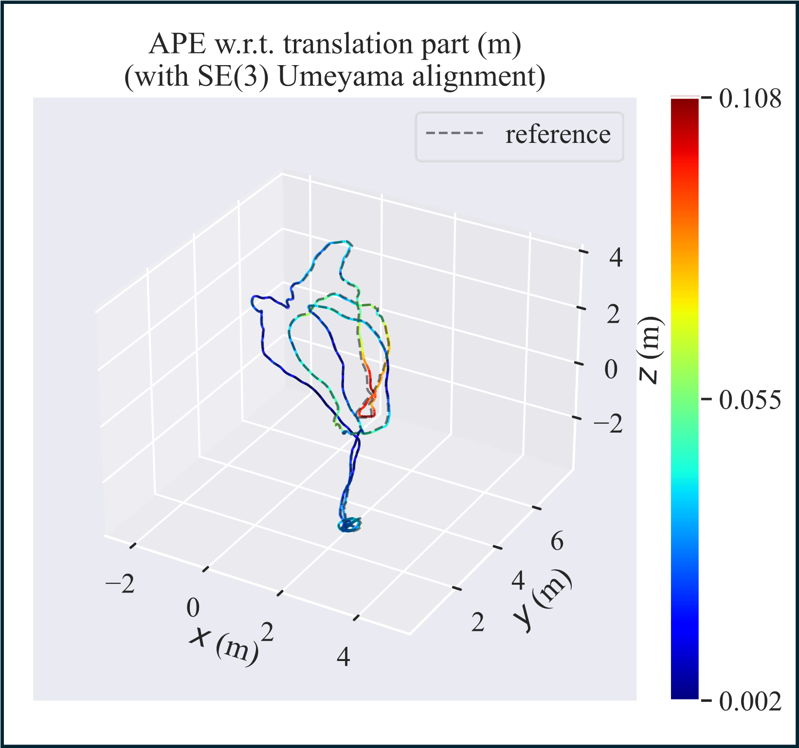

Markdown

# Research on Visual SLAM in Low Illumination Environment Based on Image Contrast Enhancement

This repository contains the C++ implementation of the image enhancement algorithms proposed in our paper, along with the trajectory evaluation results on the EuRoC dataset.

## 1. Prerequisites 

The code has been tested on **Ubuntu 20.04**. Please ensure the following dependencies are installed:

* **C++ Compiler:** C++11 or higher
* **CMake:** ≥ 2.8
* **OpenCV:** ≥ 4.0 (Required components: core, imgproc, features2d)
* **Eigen3:** ≥ 3.1.0
* **Pangolin:** (Required for UI dependencies)

## 2. Build Instructions 

Clone the repository and compile the project using CMake:

```Bash
cd your_project_folder
mkdir build
cd build
cmake ..
make
```
After successful compilation, an executable named test_app will be generated in the build directory.

## 3. Image Enhancement Test 
This program demonstrates how our method improves ORB feature extraction in low-illumination environments.

Usage
To run the test program, provide the path to a low-illumination image as an argument:

Bash
```
# Syntax: ./test_app <path_to_image>
# Example:
./test_app ../1.png
```
The program will display the original image vs. enhanced images (Gamma, CLAHE, Gaussian Blur) and output the processing time for each algorithm.

## 4. Trajectory Evaluation 
To verify the localization accuracy (ATE) reported in the paper, we provide the estimated trajectory files in the Euroc/ directory.

We use the evo package for evaluation.

### 4.1 Install evo
```
Bash
pip install evo --upgrade --no-binary evo
```

### 4.2 Run Evaluation (MH_03 Sequence)
The following command compares our estimated trajectory (MH03_trajectory.txt) against the ground truth (groundtruth.tum).

```
Bash
# Syntax: evo_ape tum <ground_truth_file> <estimated_trajectory_file> -va --plot
evo_ape tum Euroc/MH03/state_groundtruth_estimate0/groundtruth.tum Euroc/MH03/state_groundtruth_estimate0/MH03_trajectory.txt -va --plot
```
>**Note:**

* MH03_trajectory.txt: The trajectory estimated by our proposed method using enhanced images.
- groundtruth.tum: The ground truth trajectory provided by the EuRoC dataset.
+ The results demonstrate the accuracy improvement in low-illumination scenarios.
* We use -va (SE3 alignment) instead of Sim3 to demonstrate that our method maintains accurate metric scale.

### 4.3 Advanced Visualizations (e.g., MH03)
We also evaluated our method on other challenging sequences like MH05/V2-01. You can reproduce the specific plots (Trajectory Comparison, XYZ Errors, APE Heatmap) using the following commands:

#### 1.Trajectory Comparison & XYZ Error Graphs
To compare the estimated trajectory against the baseline and ground truth, and view errors along x, y, z axes:

```Bash
# Plot 3D Trajectories (OURS vs ORBSLAM3 vs Ground Truth)
evo_traj tum Euroc/MH03/state_groundtruth_estimate0/MH03_trajectory.txt Euroc/MH03/state_groundtruth_estimate0/ORBSLAM3.txt --ref=Euroc/MH03/state_groundtruth_estimate0/groundtruth.tum -va --plot --plot_mode=xyz
```
(Tip: To generate the 2D Error graphs along x, y, z axes, simply remove --plot_mode=xyz from the command above.)

#### 2.APE Heatmap & Error Line Graph
To analyze the Absolute Pose Error (APE) distribution and its evolution over time:

```Bash
# Plot APE Heatmap on Trajectory
evo_ape tum Euroc/MH03/state_groundtruth_estimate0/groundtruth.tum Euroc/MH03/state_groundtruth_estimate0/MH03_trajectory.txt -va --plot --plot_mode=xyz
```

## 5. Visualization Comparison 

The following heatmap comparison demonstrates the improvement of our method (GCG-ORB) over the baseline (ORB-SLAM3) on the **MH03** sequence.

| **Baseline (ORB-SLAM3)** | **Ours (GCG-ORB)** |
| :---: | :---: |
|  |  |
| *Notice the high-error (red/yellow) regions caused by tracking instability.* | *Significant reduction in error, showing a more stable blue trajectory.* |

**Analysis:**
* The baseline algorithm suffers from large translation errors (indicated by red segments) due to feature loss in low-illumination areas.
* Our method maintains accurate metric scale and low drift (predominantly blue/green) throughout the sequence, verifying the robustness of the proposed enhancement pipeline.


## 6. License
This source code is released under the MIT License.
