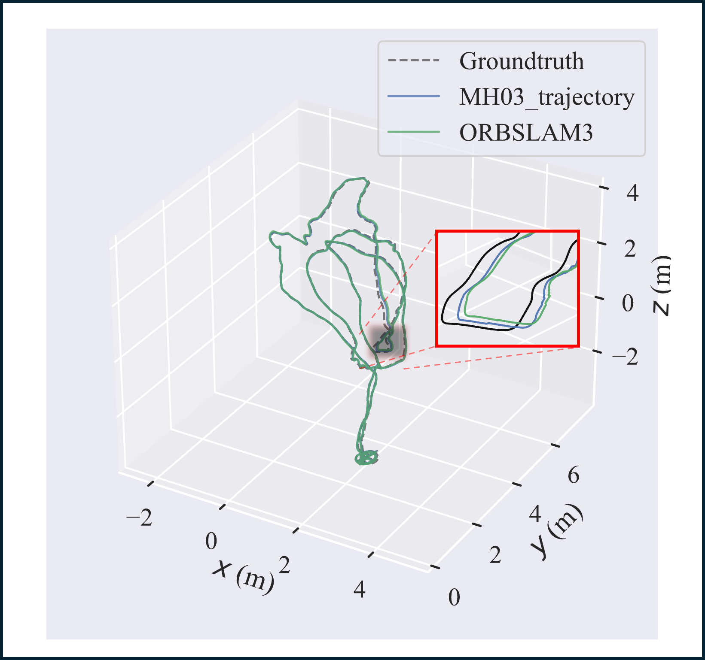
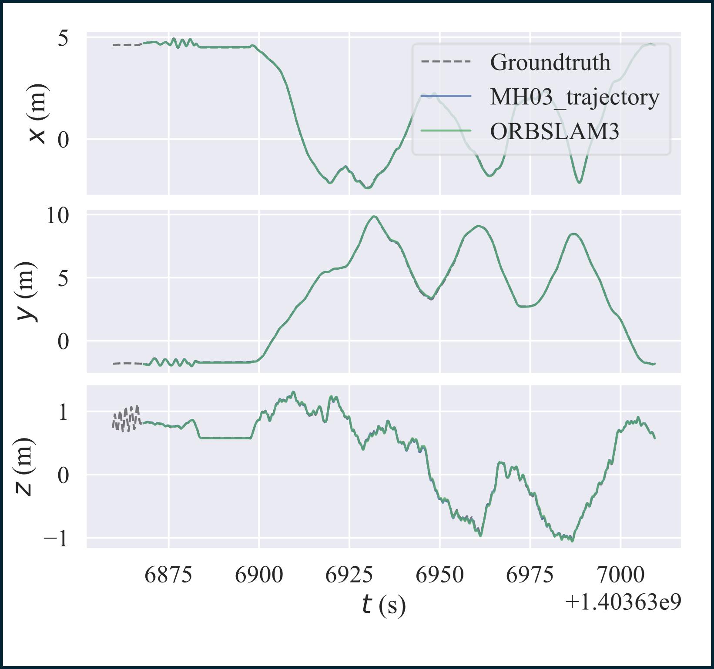
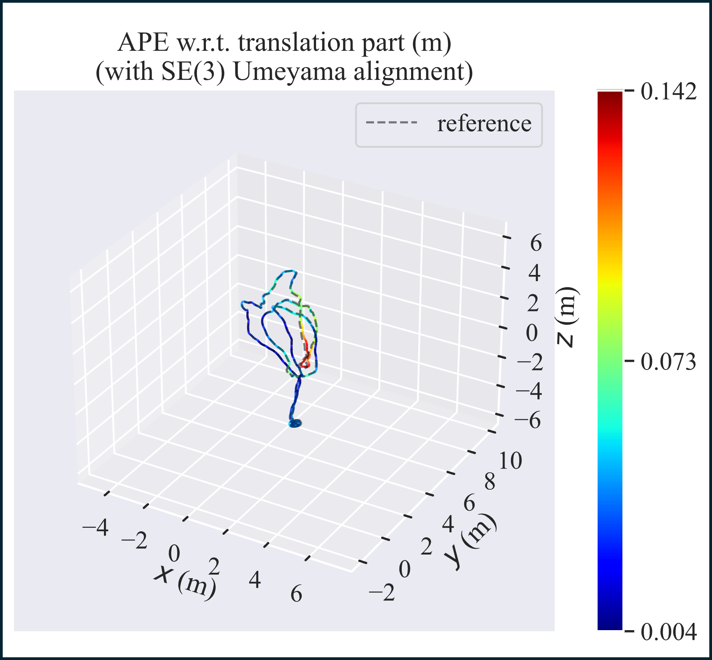
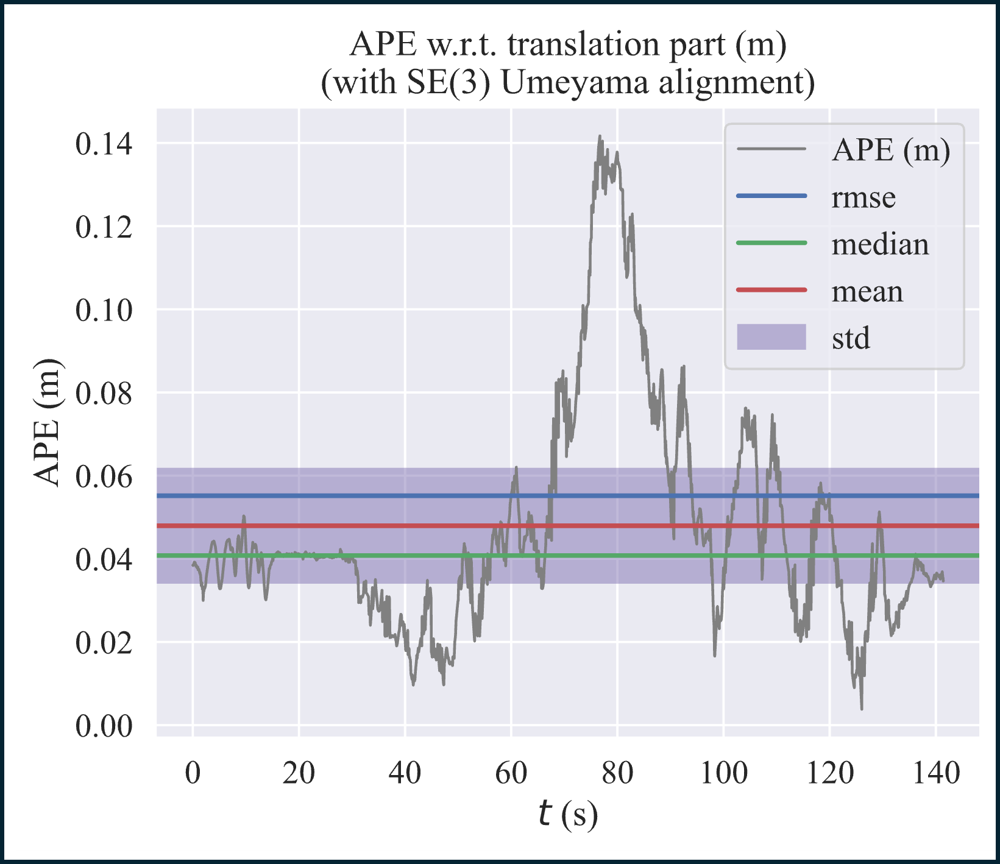
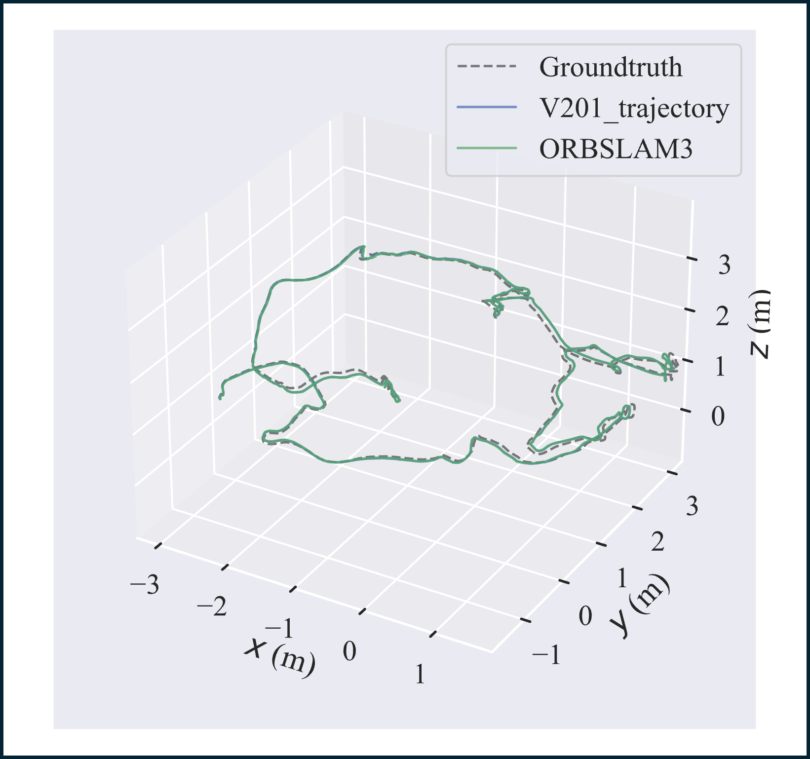
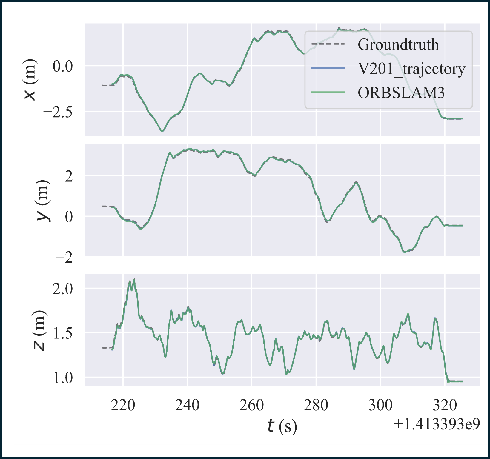
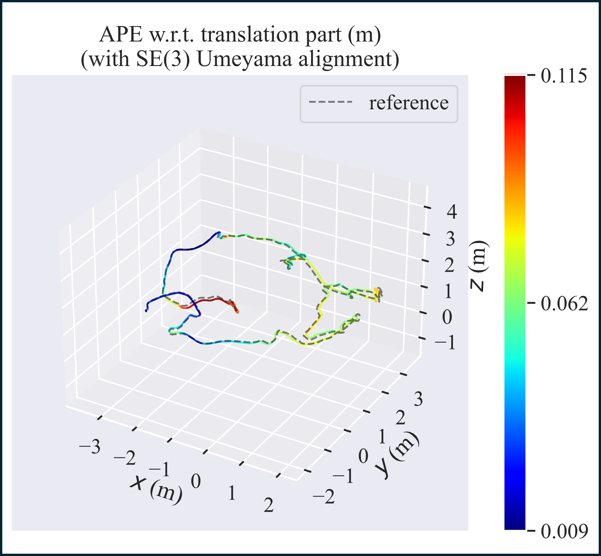

Markdown

# Research on Visual SLAM in Low Illumination Environment Based on Image Contrast Enhancement

This repository contains the C++ implementation of the image enhancement algorithms proposed in our paper, along with the trajectory evaluation results on the EuRoC dataset.

## 1. Prerequisites 

The code has been tested on **Ubuntu 20.04**. Please ensure the following dependencies are installed:

* **C++ Compiler:** C++11 or higher
* **CMake:** ≥ 2.8
* **OpenCV:** ≥ 4.0 (Required components: core, imgproc, features2d)
* **Eigen3:** ≥ 3.1.0
* **Pangolin:** (Required for UI dependencies)

## 2. Build Instructions 

Clone the repository and compile the project using CMake:

```Bash
cd your_project_folder
mkdir build
cd build
cmake ..
make
```
After successful compilation, an executable named test_app will be generated in the build directory.

## 3. Image Enhancement Test 
This program demonstrates how our method improves ORB feature extraction in low-illumination environments.

Usage
To run the test program, provide the path to a low-illumination image as an argument:

Bash
```
# Syntax: ./test_app <path_to_image>
# Example:
./test_app ../1.png
```
The program will display the original image vs. enhanced images (Gamma, CLAHE, Gaussian Blur) and output the processing time for each algorithm.

## 4. Trajectory Evaluation 
To verify the localization accuracy (ATE) reported in the paper, we provide the estimated trajectory files in the Euroc/ directory.

We use the evo package for evaluation.

### 4.1 Install evo
```
Bash
pip install evo --upgrade --no-binary evo
```

### 4.2 Run Evaluation (MH_03 Sequence)
The following command compares our estimated trajectory (MH03_trajectory.txt) against the ground truth (groundtruth.tum).

```
Bash
# Syntax: evo_ape tum <ground_truth_file> <estimated_trajectory_file> -va --plot
evo_ape tum Euroc/MH03/state_groundtruth_estimate0/groundtruth.tum Euroc/MH03/state_groundtruth_estimate0/MH03_trajectory.txt -va --plot
```
>**Note:**

* MH03_trajectory.txt: The trajectory estimated by our proposed method using enhanced images.
- groundtruth.tum: The ground truth trajectory provided by the EuRoC dataset.
+ The results demonstrate the accuracy improvement in low-illumination scenarios.
* We use -va (SE3 alignment) instead of Sim3 to demonstrate that our method maintains accurate metric scale.


## 5. Visualization & Analysis 

We demonstrate the performance of GCG-ORB in two challenging scenarios: **Low Illumination (MH03)** and **Complex Lighting Changes (V201)**.

### 5.1 Case Study: MH03 (Low Illumination)
Comparison of 3D trajectory alignment, spatial error distribution, and temporal stability on the MH03 sequence.

#### (1) Trajectory & XYZ Drift
| **3D Trajectory Comparison** | **XYZ Translation Error** |
| :---: | :---: |
|  |  |
| *Blue: OURS, Green: Baseline, Gray: GT* | *Drift analysis on X/Y/Z axes* |

#### (2) Spatial Error Heatmap (Baseline vs Ours)
| **Baseline (ORB-SLAM3)** | **Ours (GCG-ORB)** |
| :---: | :---: |
|  |  |
| *High error (Red) in dark areas* | *Significant error reduction (Blue)* |

#### (3) Temporal Stability (APE Line Graph)
| **Baseline (ORB-SLAM3)** | **Ours (GCG-ORB)** |
| :---: | :---: |
|  |  |
| *Frequent error spikes* | *Stable and flat error curve* |

> **💡 Analysis for MH03:**
> * **Spatial Accuracy:** The heatmap clearly shows that the **Baseline** suffers from large drifts (indicated by **Red/Yellow** segments) when entering dark textureless regions. In contrast, **Ours** maintains a consistent **Blue** trajectory, proving effective feature recovery.
> * **Stability:** The line graph comparison highlights that GCG-ORB significantly reduces the **error spikes** (sudden jumps in error), resulting in a much lower Standard Deviation (STD) and smoother tracking.

**💻 Reproduction Commands for MH03:**
```bash
# 1. Generate Trajectory & XYZ Error plots
evo_traj tum Euroc/MH03/state_groundtruth_estimate0/MH03_trajectory.txt Euroc/MH03/state_groundtruth_estimate0/ORBSLAM3.txt --ref=Euroc/MH03/state_groundtruth_estimate0/groundtruth.tum -va --plot --plot_mode=xyz
```

```bash
# 2. Generate Heatmap & Line Graph (Run separately for Baseline and Ours)
# For Baseline:
evo_ape tum Euroc/MH03/state_groundtruth_estimate0/groundtruth.tum Euroc/MH03/state_groundtruth_estimate0/ORBSLAM3.txt -va --plot --plot_mode=xyz
# For Ours:
evo_ape tum Euroc/MH03/state_groundtruth_estimate0/groundtruth.tum Euroc/MH03/state_groundtruth_estimate0/MH03_trajectory.txt -va --plot --plot_mode=xyz
```


### 5.2 Case Study: V201 (Complex Lighting)
Analysis of robustness under rapid lighting changes and motion blur.

#### (1) Trajectory & XYZ Drift
| **3D Trajectory Comparison** | **XYZ Translation Error** |
| :---: | :---: |
|  |  |
| *Trajectory alignment under lighting changes* | *Drift analysis on X/Y/Z axes* |

#### (2) Spatial Error Heatmap (Baseline vs Ours)
| **Baseline (ORB-SLAM3)** | **Ours (GCG-ORB)** |
| :---: | :---: |
|  |  |
| *Red segments indicate large drift* | *Maintains accuracy (Blue) throughout* |

> **💡 Analysis for V201:**
> * **Robustness to Light Changes:** V201 is characterized by rapid exposure changes and motion blur. The **Baseline** heatmap reveals severe scale drifts and potential tracking loss (indicated by large **Red** loops) when lighting conditions fluctuate.
> * **Consistency:** In contrast, **Ours (GCG-ORB)** successfully compensates for illumination variance, maintaining a highly accurate and continuous trajectory (**Blue/Green**) that closely follows the ground truth, proving its adaptability to dynamic environments.

**💻 Reproduction Commands for V201:**
```bash
# 1. Generate Trajectory & XYZ Error plots
evo_traj tum Euroc/V201/state_groundtruth_estimate0/V201_trajectory.txt Euroc/V201/state_groundtruth_estimate0/ORBSLAM3.txt --ref=Euroc/V201/state_groundtruth_estimate0/groundtruth.tum -va --plot --plot_mode=xyz
```
```bash
# 2. Generate Heatmap (Run separately)
# For Baseline:
evo_ape tum Euroc/V201/state_groundtruth_estimate0/groundtruth.tum Euroc/V201/state_groundtruth_estimate0/ORBSLAM3.txt -va --plot --plot_mode=xyz
# For Ours:
evo_ape tum Euroc/V201/state_groundtruth_estimate0/groundtruth.tum Euroc/V201/state_groundtruth_estimate0/V201_trajectory.txt -va --plot --plot_mode=xyz
```


## 6. License
This source code is released under the MIT License.
